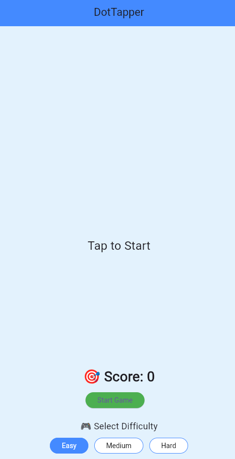

# 🎮 DotTapper - A Simple Flutter Game

**DotTapper** is a minimalist and fun Flutter-based mobile game where players tap on randomly appearing dots to earn points within a 30-second time limit. The game is lightweight, responsive, and a great starting point for Flutter game developers.

 <!-- Optional: Add a screenshot in your repo -->

---

## 🚀 Features

- 🟢 Simple tap-based gameplay
- ⏱️ 30-second countdown timer
- 🔴 Randomly moving dot
- 🏆 Real-time score counter
- 🔁 Start, Stop, and Restart functionality

---

## 🛠️ Built With

- [Flutter](https://flutter.dev/) – Cross-platform UI toolkit
- Dart Programming Language

---

## 📦 Installation

1. **Clone the repo**:
   ```bash
   git clone https://github.com/yourusername/dottapper.git
   cd dottapper
